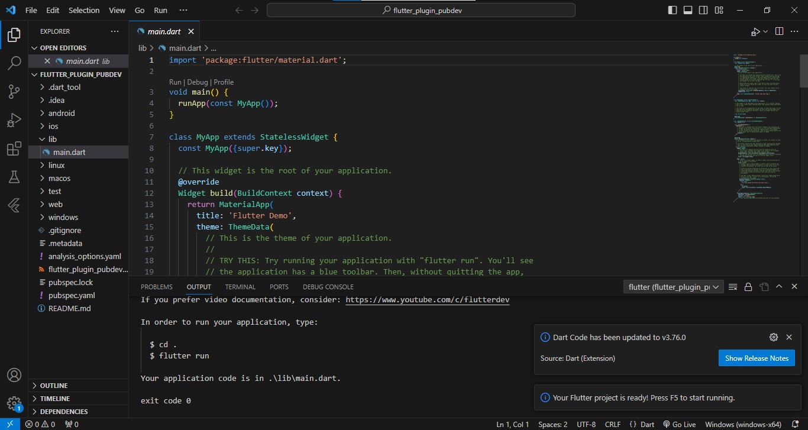
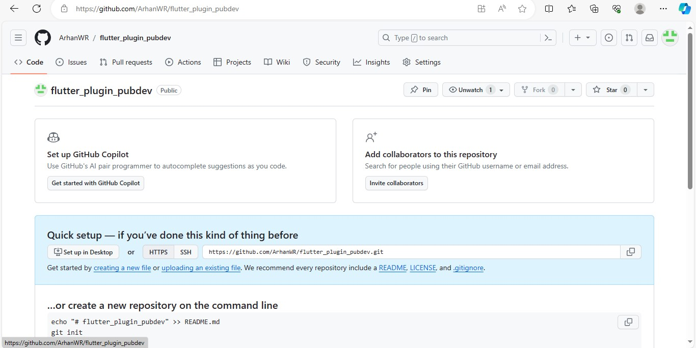
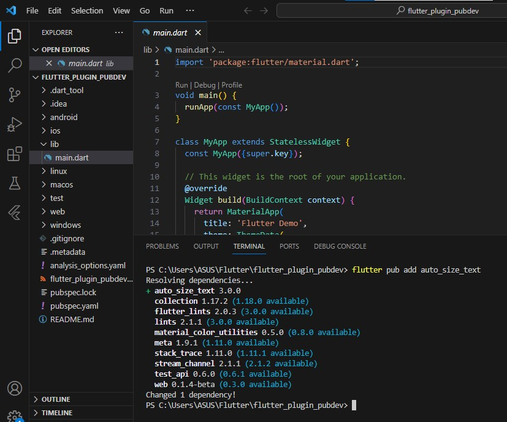
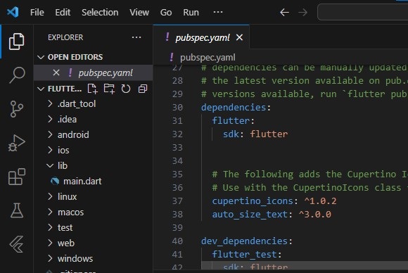
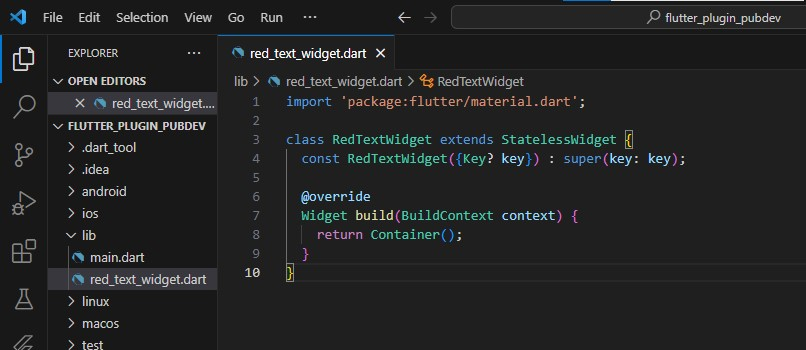
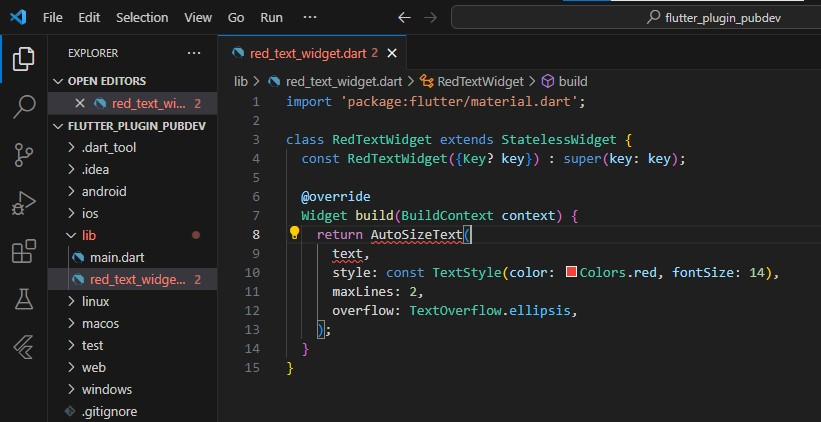
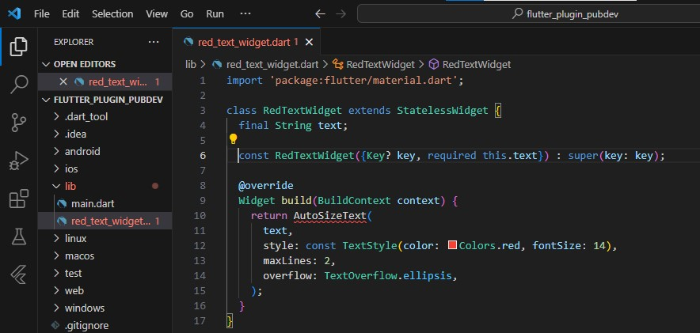
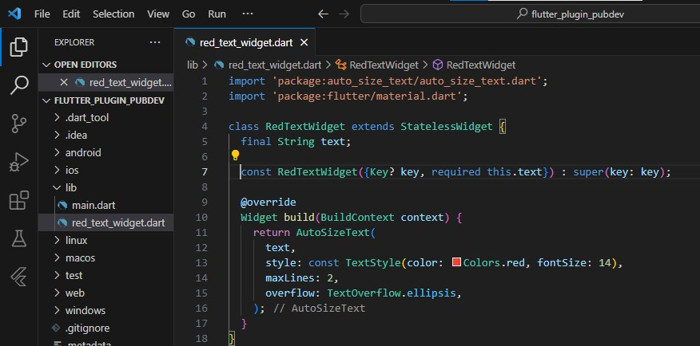
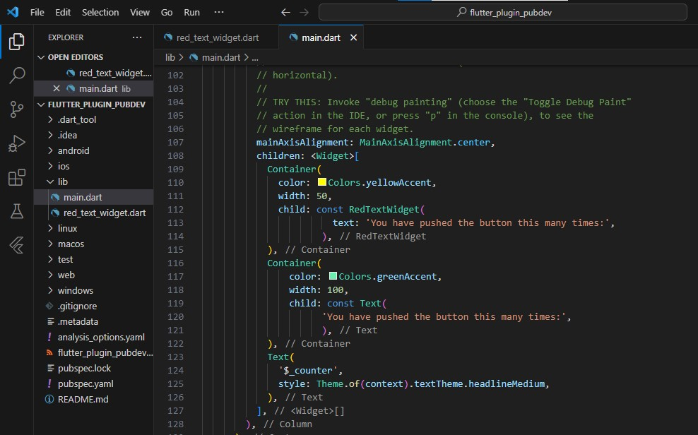
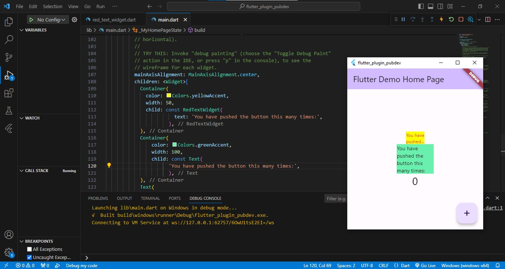

# flutter_plugin_pubdev

A new Flutter project.

<b>Praktikum Menerapkan Plugin di Project Flutter</b>

Langkah 1: Buat Project Baru
Buatlah sebuah project flutter baru dengan nama flutter_plugin_pubdev. Lalu jadikan repository di GitHub Anda dengan nama flutter_plugin_pubdev.
flutter baru dengan nama flutter_plugin_pubdev.

repository di GitHub dengan nama flutter_plugin_pubdev.

Langkah 2: Menambahkan Plugin
Tambahkan plugin auto_size_text menggunakan perintah berikut di terminal

flutter pub add auto_size_text

Jika berhasil, maka akan tampil nama plugin beserta versinya di file pubspec.yaml pada bagian dependencies.

Langkah 3: Buat file red_text_widget.dart
Buat file baru bernama red_text_widget.dart di dalam folder lib lalu isi kode seperti berikut.

import 'package:flutter/material.dart';

class RedTextWidget extends StatelessWidget {
  const RedTextWidget({Key? key}) : super(key: key);

  @override
  Widget build(BuildContext context) {
    return Container();
  }
}

Langkah 4: Tambah Widget AutoSizeText
Masih di file red_text_widget.dart, untuk menggunakan plugin auto_size_text, ubahlah kode return Container() menjadi seperti berikut.

return AutoSizeText(
      text,
      style: const TextStyle(color: Colors.red, fontSize: 14),
      maxLines: 2,
      overflow: TextOverflow.ellipsis,
);

Setelah Anda menambahkan kode di atas, Anda akan mendapatkan info error. Mengapa demikian? Jelaskan dalam laporan praktikum Anda!
Karena terdapat 2 data invalid yaitu AutoSizeText karena metode tersebut belum terdefinisi pada redtextwidget tersebut dan text karena text masih belum terdefinisi pada redtextwidget tersebut.

Langkah 5: Buat Variabel text dan parameter di constructor
Tambahkan variabel text dan parameter di constructor seperti berikut.

final String text;

const RedTextWidget({Key? key, required this.text}) : super(key: key);

karena menambahkan variabel text tersebut text menjadi valid, selanjutnya saya menambahkan import 'package:auto_size_text/auto_size_text.dart'; agar AutoSizeTextnya valid.

Langkah 6: Tambahkan widget di main.dart
Buka file main.dart lalu tambahkan di dalam children: pada class _MyHomePageState

Container(
   color: Colors.yellowAccent,
   width: 50,
   child: const RedTextWidget(
             text: 'You have pushed the button this many times:',
          ),
),
Container(
    color: Colors.greenAccent,
    width: 100,
    child: const Text(
           'You have pushed the button this many times:',
          ),
),

Run aplikasi tersebut dengan tekan F5, maka hasilnya akan seperti berikut.
